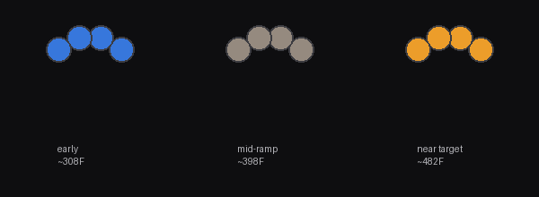

← [Back to main README](../README.md)

# Aeris ramp patch

> [!CAUTION]
> **Do not flash this patch.** A crash-on-boot bug class was found in all three patches — see the [warning in the main README](../README.md). Fixes are in progress.

Adds the same autonomous, on-device temperature ramp as the Carta 2 patch, adapted to Aeris's
different firmware. Aeris has no screen, so progress shows as a live color gradient across its 4
RGB LEDs (cool blue → hot amber, based on measured temperature) instead of an on-screen graph.



*A rendered mockup, not a photo — nothing here has been confirmed against real LEDs. The gradient
math matches `ramp_led.c` exactly; note the mid-ramp color renders as a muted gray-brown rather
than something more vivid, a known property of straight-line RGB interpolation between blue and
amber, not a bug — flagged, not yet fixed.*

**Status: built and internally verified, with one honest gap the Carta 2 patch doesn't have — not
yet installed on real hardware, and the free-flash region this patch's code lives in could not be
independently verified at all (not "not yet," genuinely cannot be, from this dump — see below).**
Read the whole page, especially "What's confirmed, what's reasoned, what's unverifiable," before
flashing anything you depend on.

## What it actually changes

Two same-length call-site patches plus a differently-structured LED-progress mechanism (no screen
to patch into, so no analog to the Carta 2 patch's three display call sites):

| Site | Stock function | Replaced with | What it does |
|---|---|---|---|
| `0x6464` | per-tick PID/session orchestrator call, inside the main scheduler loop | `ramp_trampoline` | Runs the original tick (`FUN_00008154`) unmodified, then the ramp sequencer, then the LED progress update |
| `0xb490` | marker-byte load, just before the stock `0xA5`/`0xAF`/`0x66` compare chain in the `0xCC` handler | `ramp_marker_entry` | Replicates the load, calls `ramp_marker_dispatch` for the 5 new waypoint-save markers (`0xB1`-`0xB5`), leaves the untouched chain right after it working exactly as before |

The wire packet format (the `0xCC`/SET_TEMP BLE command) is byte-for-byte identical to the Carta 2
packet — confirmed by matching every field's byte offset. This means the app-side code
(`buildTempCommand`, `buildRampWaypointSaveCommand`, etc.) needs no Aeris-specific changes at all;
only the firmware side differs.

## What's confirmed, what's reasoned, what's unverifiable

Not everything in this patch clears the same bar the same way — said plainly rather than rounded
up, the same principle this whole project has tried to hold to since catching real mistakes in the
Carta 2 patch earlier:

**Independently confirmed, same rigor as Carta 2** (direct decompile/disassembly against the real
binary, plus — for both call sites — independent cross-checks beyond a single reading):
- The central session struct address (`0x8430e4`), shared by both the `0xCC` handler and the tick
  function — confirmed by resolving both functions' literal-pool pointers and finding they match.
- `struct+0x0` session-active, `struct+0x6` mode flag (`1`=flower, `2`=concentrate — **not** 0/1
  like Carta 2, confirmed by direct observation, not assumed), `struct+0x2a/0x2b` measured
  temperature, `struct+0x30/0x48` custom-value temperature (flower/concentrate), `struct+0x60/0x6c`
  duration (flower/concentrate) — all confirmed via direct decompile of the `0xCC` handler.
- The tick call site (`0x6464`): found the same way the Carta 2 patch's equivalent was — an
  exhaustive scan generating the correct `tjl 0x8154` encoding, via the real assembler, at every
  possible position in the entire 80,684-byte firmware. Exactly one match, sitting in the main
  scheduler loop immediately after the already-confirmed button/event dispatcher call.
- The marker-dispatch fix: same architecture problem and same fix as Carta 2 — intercepting the
  marker load, not a single leaf of the `0xA5`/`0xAF`/`0x66` chain, since the new markers never
  match any of the three existing comparisons.
- The LED mechanism: a 12-byte RGB buffer at `0x8431dc` (4 LEDs), a brightness byte at
  `0x84562c+1`, and the push function `0x90bc`. Confirmed via direct decompile and literal-pool
  resolution, independent of anything carried over from earlier research passes.
- The flash primitives this patch's own waypoint storage uses (`0xab8` read, `0xa1c` erase, `0xa5c`
  write) — deliberately re-checked against this specific build rather than reusing the Carta 2
  patch's addresses for the same role, which were confirmed **not** to exist as functions here
  before this file was written.

**Reasoned from multiple converging facts, not a single traced instruction** — `struct+0x2c/0x2d`
(flower) and `struct+0x2e/0x2f` (concentrate) as the live PID target this patch writes directly.
The exact stock code path that populates this field for a *custom-value* (non-preset) session was
traced extensively — the atomizer-calibration routine, the glide/smoothing function, several
rank-dispatch jump table entries — without finding a single clean "convert custom temp to PID
target" function. What *is* independently confirmed: this field is compared directly against the
measured-temperature field by the stock "temperature reached" detector (`FUN_00007f14`), and it's
populated, for preset-selected sessions, by a direct byte-for-byte copy from the preset table
(`FUN_00008154`'s own init block) — and the preset table's own factory-default values (300, 350,
370, 390, 410) are unmistakably real Fahrenheit degrees, not some scaled hardware unit. Those two
facts together pin down both the field's role and its unit with real confidence, even without a
single function that visibly does "take custom value, write it here" for the custom-value case.
This patch writes the field directly, the same value (real °F) it writes into the custom-value
field right next to it, rather than trying to replicate whichever stock trigger path normally
reaches it.

**Genuinely cannot be verified from this firmware dump, not just "not yet done"** — the free flash
region (`0x14000`-`0x1FFFF`) this patch's own code and waypoint storage live in. The firmware image
is exactly 80,684 bytes long; the dump file contains nothing past that. The chosen region sits in
the same "clear space ahead of the OTA staging bank" pattern that's already established and
flash-verified for Carta 2 (and literal references to `0x20000`, the OTA bank's start, do exist in
this binary, consistent with it being the real boundary) — but there is no way to confirm those
specific bytes are actually free, erased flash without reading the real flash chip on a real
device. This is the one thing in this patch that only hardware access can close.

**Not independently fingerprinted against a complete download** — unlike the Carta 2 patch,
`apply_patch.py` here checks the stripped firmware body's hash (`7e3569fabd06`, 80,684 bytes), not
a full header-included file hash, because a complete real Aeris download with its original header
hasn't been independently captured and verified this session the way Carta 2's was. The header
your own downloaded file carries is used as-is; only the `KNLT` magic byte is checked.

## How to apply it

Same process as the [Carta 2 patch](../carta2/README.md#how-to-apply-it): get your own copy of the
stock Aeris firmware from Focus V's own update infrastructure, then:

```
python3 apply_patch.py --input your-stock-firmware.bin --output patched.bin
```

## How to flash it

Same two options as Carta 2 — physical/UART via the research repo's hardware setup guide, or over
Bluetooth via `ota-flash.html`. Both are device-agnostic; neither needed Aeris-specific changes.

## Reversibility

Same as Carta 2: this patch only touches the two call sites above, nothing in the device's
temperature limits, safety cutoffs, or core control loop. Flash your original, unpatched file to
revert, any time.
