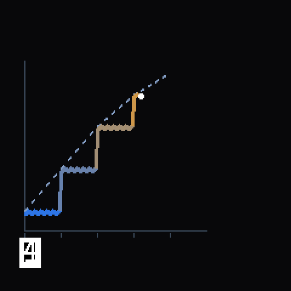

← [Back to main README](../README.md)

# Carta 2 ("Quantum") ramp patch

> [!WARNING]
> **Not yet tested on real hardware.** It passes every build check and an independent
> disassembler cross-check; flash only a device you can recover over SWire. See the
> [main README](../README.md).

Runs a Terpline-uploaded ramp of up to 5 stages on the device itself. While a ramp runs, the
heating screen is replaced by the ramp screen, and the buttons change meaning.



*A rendered mockup, not a photo: the screen's drawing logic run against the real glyph
bitmaps from this build. Scenario: stage 3 of 5, 41 s into a 75 s stage, 68% battery. The
measured trace is simulated. Not confirmed against a real screen.*

## Firmware build

```text
Device:  Carta 2 ("Quantum")
Build:   PROD-111224
File:    143,604 bytes as downloaded (143,564-byte body + 40-byte header)
SHA-1:   a6b741dc0508... (whole file)
```

`apply_patch.py` patches only this exact file. There is no override.

## The ramp screen (240 x 240)

| Area | Left | Right (right-aligned to x 233) |
| --- | --- | --- |
| y 20 | battery % and icon (charging animation when charging) | current stage's goal / the ramp's highest goal, e.g. `400/450°F` |
| y 44 | time left, M:SS, counting down from the ramp's total | live temperature (large) |
| y 72–196 | the chart (x 6–219) | the heat meter (x 226–233) |
| y 202–224 | the Terpline flame mark + wordmark | `DABS` + the dab count |

- **The chart** is framed by a left axis, a baseline and a right axis. Time runs left to right
  across the whole ramp.
  - **The arc** is the goal: the ramp's planned temperature over time, a smooth line through each
    stage's start, coloured by heat.
  - **The trace** is the measured temperature since the ramp began, in white, one sample per
    column. Its newest point bounces with the live reading. It climbs in steps as each stage
    heats up to meet the arc. Pressing **−** rewinds it along with the ramp.
- **The Terpline mark** sits under the chart: the flame logo and wordmark in four flat brand
  colours, stored as 266 rectangle runs (806 bytes), generated from the logo by
  [`tools/make_logo.py`](../tools/make_logo.py).
- **The dab count** is the same per-mode counter the stock screen shows (flower total with a
  flower atomizer, concentrate total with a concentrate one), right-aligned to the same edge as
  the temperatures, and it ticks up the moment a ramp reaches stage 3.
- **The heat meter** is a column of 10 circles, blue at the bottom through green, yellow and
  orange to red at the top, lit up to the live temperature.

Both the chart's height and the meter use this ramp's own range, never an absolute degree
scale: from its coolest stage minus a margin, up to its hottest. So every ramp fills the box the
same way.

During a ramp the stock bottom row -- dab counter, mode icon, status icon and READY banner
(y 193–225) -- is hidden so the chart and logo can use it; the dab count and the ready cue still
work, they just aren't drawn until the ramp ends.

Every stock element whose space this uses is hidden only while a ramp is active, at every one of
its call sites. When no ramp is active, every hook calls the original function, unchanged. The
drawing primitives were decompiled before use: `fill_rect` (0x74d0) and `blit` (0x7e2c) both
draw (w+1) x (h+1) pixels, opaquely.

## Buttons during a ramp

The patch hooks the only call to the stock button-event consumer (0x5618):

- **main button, single click:** stop, at any stage, through the stock heating screen's own stop path
- **+ / − short press:** next / previous stage
- **+ / − held, double click:** ignored. Auto-repeat would skip every stage, and the stock +10 s
  would rewind the ramp clock.

Outside a ramp, every event goes to the stock consumer unchanged.

## Preset picker

Hold − from the idle screen to open the picker. A box over the stock target line shows the
selected preset's number and a row of six markers (the lit one is selected). + and − step through
the six built-in presets, and a click leaves the picker and keeps the choice. The stock screen
returns to its normal target line on exit. The box is cleared to black while the picker is open,
so the target line underneath is hidden until then.

## On/off switch: hold + and − together

Hold + and − down at the same time, any time (not only during a ramp), to toggle the whole ramp
system on or off, directly on the device, no app needed -- the same feature Aeris and Sport get
from a quadruple click of their single button:

- **Off**: no new ramp can arm, and no new waypoint can be saved -- a stage-save packet is
  dropped with no flash write at all, the same as on stock firmware. A ramp already running
  finishes or stops normally; it isn't interrupted.
- **On**: back to normal.

It's stored as one more byte in the same flash sector as the waypoints, so it survives a power
cycle, and is shared with the Aeris/Sport toggle's own flag layout. A device that's never had this
toggled reads as **on** -- today's behaviour, unchanged.

The Carta 2 has no single click-counter like Aeris/Sport's LED preset cycle, so this doesn't reuse
that mechanism. It instead watches the same + / − press and held events the existing stage-stepping
feature above already consumes: holding − sets one flag, holding + sets the other (either one's own
short-press or held/auto-repeat event counts as "held"; any other event clears both), and the
instant both are set, it toggles and clears them. The combo is only ever *read*, never consumed --
real hardware testing confirmed holding + and − together (or all three buttons) does nothing
visible on stock firmware, and this patch doesn't change that: whatever stock does, or doesn't do,
with + or − individually is completely unaffected, during a ramp or not.

## Patch sites (32, all written and checked by `tools/build.py`)

| Site(s) | Stock call | Replaced with |
| --- | --- | --- |
| 0x6e2e | orchestrator `0xaf2c` (the only caller) | `ramp_trampoline`: stock tick, then the ramp |
| 0x11d96 | marker-byte load before the A5/AF/66 chain | `ramp_marker_entry`: waypoint upload markers |
| 0x6d0c | event consumer `0x5618` (the only caller) | `ramp_event_entry` |
| 0xfa38 / 0xf546 | `0xd3c0` live temperature (full / view) | ramp screen |
| 0xfa3c / 0xf39c | `0xdcac` session countdown (full / view) | ramp screen |
| 7 sites | `0xce70` target | hidden during a ramp |
| 7 sites | `0xcf58` slot hold time | hidden during a ramp |
| 3 sites | `0xdb40` battery | hidden during a ramp (drawn by the ramp screen) |
| 2 sites each | `0xd048` dab counter, `0xe42c` mode icon, `0xe300` status icon, `0xe2b4` READY banner | hidden during a ramp |

The code goes at flash 0x30000 and runs at 0x30028. The waypoint store has its own sector at
0x32000. The output image ends at 0x33000.

Every address in [`device.h`](device.h) is listed with the stock code that proves what it means.

## Device-specific behaviour

- The stock session clock runs from the start of each stage, so each hold is wall-clock time.
- The dab counter base is 0x8430e0, and saving is armed by setting +31 = 50 and +33 = 0, exactly as
  the stock timer does when a session finishes.
- Flash writes go through `0x19a78`. An earlier version used `0x19308`, which is the PROD-071024
  address and lands mid-function in this build.
