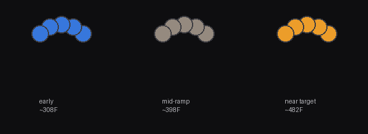

← [Back to main README](../README.md)

# Carta Sport ramp patch

Adds the same autonomous, on-device temperature ramp as the Carta 2 and Aeris patches, adapted to
Carta Sport's different firmware. Like Aeris, Sport has no screen — progress shows as a live color
gradient (cool blue → hot amber, based on measured temperature) across its RGB LEDs. Sport has 5
individually-addressable LEDs (confirmed hardware fact — Aeris has 4).



*A rendered mockup, not a photo — same caveats as the Aeris patch's mockup: nothing confirmed
against real LEDs, and the mid-ramp color's muted gray-brown is a known straight-line-RGB-lerp
property, not a bug.*

**Status: built and internally verified, with the same honest gap Aeris has and Carta 2 doesn't —
not yet installed on real hardware, and the free-flash region this patch's code lives in could not
be independently verified at all from this firmware dump.** Read the whole page, especially
"What's confirmed, what's reasoned, what's unverifiable," before flashing anything you depend on.

## What it actually changes

| Site | Stock function | Replaced with | What it does |
|---|---|---|---|
| `0x58b0` | per-tick PID/session orchestrator call, inside the main scheduler loop | `ramp_trampoline` | Runs the original tick (body starting `0x7c00`) unmodified, then the ramp sequencer, then the LED progress update |
| `0xb002` | marker-byte load, just before the stock `0xA5`/`0xAF`/`0x66` compare chain in the `0xCC` handler | `ramp_marker_entry` | Replicates the load, calls `ramp_marker_dispatch` for the 5 new waypoint-save markers (`0xB1`-`0xB5`), leaves the untouched chain right after it working exactly as before |

The wire packet format is byte-for-byte identical to Carta 2 and Aeris — confirmed by matching
every field's byte offset. No app-side changes needed for Sport either.

## What's confirmed, what's reasoned, what's unverifiable

Same discipline as the other two device READMEs — said plainly rather than rounded up:

**Independently confirmed, same rigor as the other two devices:**
- Central struct address (`0x8426ec`), shared by both the `0xCC` handler and the tick function.
- `struct+0x0` session-active, `struct+0x6` mode flag (`1`=flower, `2`=concentrate — same
  convention as Aeris, different from Carta 2's 0/1), `struct+0x2a/0x2b` measured temperature,
  `struct+0x30/0x48` custom-value temperature (flower/concentrate, confirmed real Fahrenheit when
  the app sends Fahrenheit-scale packets — directly confirmed by reading the Fahrenheit-path
  branch's own field writes end to end, not inferred by analogy), `struct+0x60/0x6c` duration.
- The tick call site (`0x58b0`): found via the same exhaustive scan as both other devices — the
  correct `tjl 0x7c00` encoding generated by the real assembler at every possible position in the
  entire 90,860-byte firmware, via Docker. Exactly one match.
- The marker-dispatch fix at `0xb002`: same architecture problem and same fix as the other two
  devices — intercepting the marker load, not a single leaf of the `0xA5`/`0xAF`/`0x66` chain.
- The LED mechanism: a 15-byte RGB buffer (`0x8427f8`, 5 LEDs) and push function (body starting
  `0x8cf8`). **Its gate architecture was independently checked and confirmed DIFFERENT from
  Aeris's** — Sport's push loop runs unconditionally regardless of a gate flag that (on this
  device) only controls an optional "reset to black" pre-step, unlike Aeris's equivalent flag,
  which gates the entire push. This patch does not force anything open here, unlike the Aeris
  patch, which genuinely needs to for its own confirmed-different gate shape.
- The flash primitives (`0xc0e8` write, `0xc178` erase) — checked fresh for this build, not reused
  from either other device (both of which use different addresses again).
- **The divide helper is at `0x1529c`, not `0x1ac`** — confirmed absent at `0x1ac` before writing
  any code that might have assumed otherwise. This is the single most important catch in this
  patch's whole build process: reusing `0x1ac` unchecked (easy to do, since it worked for both
  Carta 2 and Aeris) would have meant every division this patch performs jumped into unrelated code
  on a real device.

**Reasoned from multiple converging facts, not a single traced instruction** — same situation as
Aeris's analogous fields: `struct+0x14/0x15` (flower) and `struct+0x16/0x17` (concentrate) as the
live PID target this patch writes directly. See [`../aeris/README.md`](../aeris/README.md) for the
full "why" behind treating this as settled despite not tracing one clean "convert custom temp to
target" function — the same reasoning applies here, independently re-checked against this binary's
own tick function rather than assumed to transfer from Aeris.

**Genuinely cannot be verified from this firmware dump** — the free flash region (`0x18000`-
`0x1FFFF`) this patch's own code and waypoint storage live in. The firmware image is exactly 90,860
bytes long; the dump contains nothing past that. Same structural limitation as Aeris, with one
small difference worth noting: Sport's OTA staging bank at `0x20000` was confirmed *directly* here
(a real erase-loop targeting it was found and decompiled), where Aeris's was only inferred by
pattern — a slightly stronger anchor for *where the free region ends*, but it doesn't change the
fact that nothing about *what's actually in* `0x18000`-`0x1FFFF` can be checked without real
hardware.

**Not independently fingerprinted against a complete download** — same situation as Aeris:
`apply_patch.py` checks the stripped firmware body's hash (`4b57f086a175`, 90,860 bytes), not a
full header-included file hash.

## How to apply it

Same process as the other two patches: get your own copy of the stock Carta Sport firmware from
Focus V's own update infrastructure, then:

```
python3 apply_patch.py --input your-stock-firmware.bin --output patched.bin
```

## How to flash it

Same two options as the other devices — physical/UART via the research repo's hardware setup
guide, or over Bluetooth via `ota-flash.html`. Both are device-agnostic.

## Reversibility

Same as the other two patches: this only touches the two call sites above, nothing in the device's
temperature limits, safety cutoffs, or core control loop. Flash your original, unpatched file to
revert, any time.
